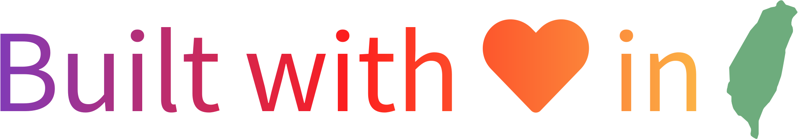

<h1 align="center">👨🏻‍💻 Hello There, I'm Tomy Hsieh 👋🏻</h1>

    
    
    
    

    
    

- 🏛 Junior student major in computer science at NCHU
- 🔬 Research assistant at [NLP Lab](https://nlpnchu.org)
- 💗 Love finely crafted software & products.
- 🔭 Currently working on...
  - A testing visualization framework built with Django, which is my internship works at [@intel](https://github.com/intel).
  - Speed-running the [You Don't Know JS](https://github.com/getify/You-Dont-Know-JS/blob/1st-ed/README.md) series.
  - Finalizing my first grand-size side project - [Tubee](https://github.com/tomy0000000/Tubee).
- 👋🏻 Feel free to reachout to me with badges above.

    

